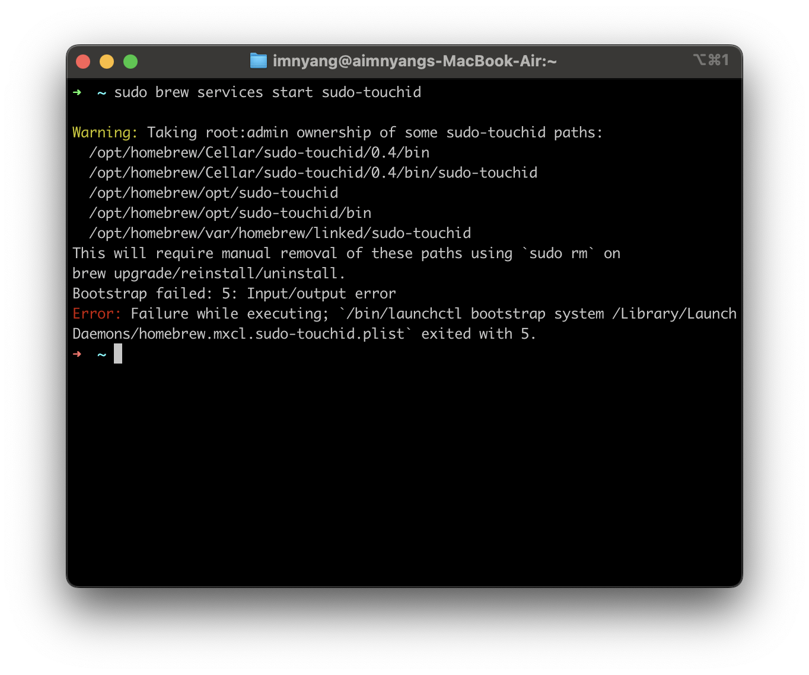

MacOS를 사용할 때 sudo 사용 시 Password 입력이 귀찮죠...

~~서버에서도 sudo 비번 없이 쓰는 놈~~

근데 또 sudo 비번이 없으면 ~~악성 남냥~~이 쉘을 탈취해 악성 커맨드를 입력할 수 있으니 비번이 필요합니다!

이런 과정을 줄이기 위해 TouchID를 통해 sudo 명령어를 인증해보도록 하겠습니다.

## HomeBrew로 설치 (권장)

[HomeBrew 설치 방법](/post/brew-install/)을 모른다고요?

```zsh
brew install artginzburg/tap/sudo-touchid
sudo brew services start sudo-touchid
```

    💡 sudo brew services start sudo-touchid를 입력했는데 이런 오류가 발생해요.
    brew install artginzburg/tap/sudo-touchid를 입력했을 때 이미 프로세스가 돌아갈수도 있어요!


## Curl로 설치

```zsh
curl -sL git.io/sudo-touchid | sh
```

## 작동 법

보통 자동으로 작동해요!

    😭 sudo 명령어를 입력했는데도 비밀번호를 요구해요...
    💬 sudo-touchid를 한번만 입력해보세요! 그럼 이후부터 TouchID를 요구할거에요.

## 제거 방법

HomeBrew인 경우
```zsh
sudo brew services stop sudo-touchid
brew remove sudo-touchid
```

Curl 설치인 경우
```zsh
sudo-touchid --disable
```